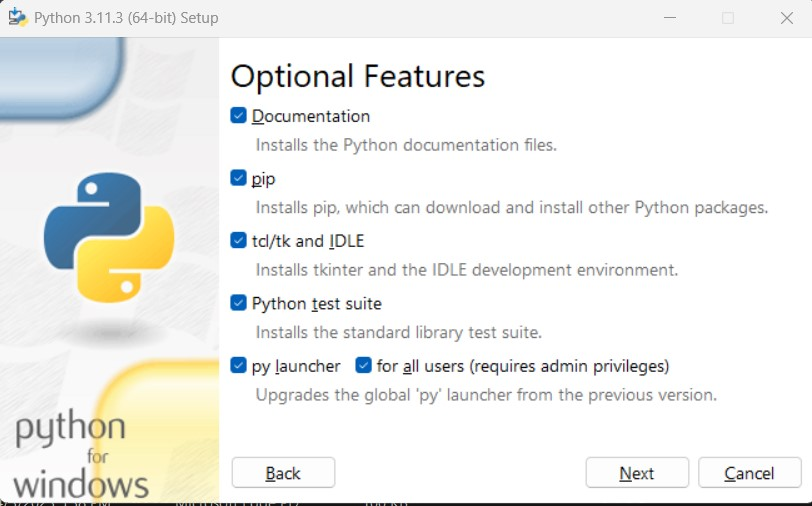
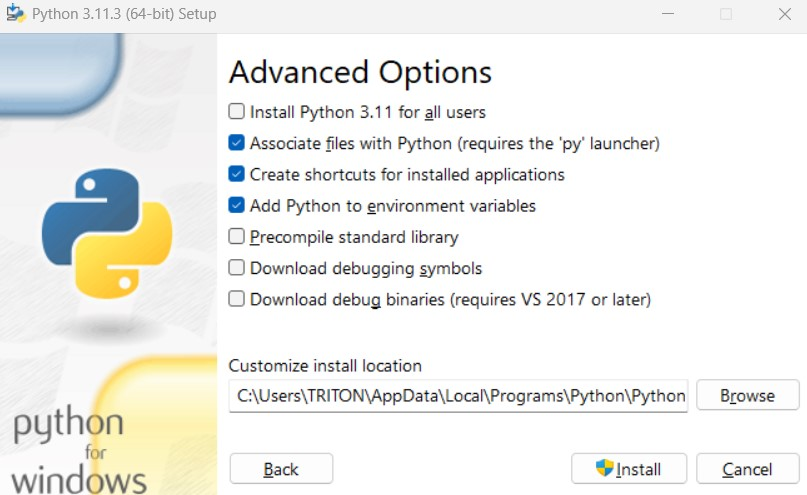
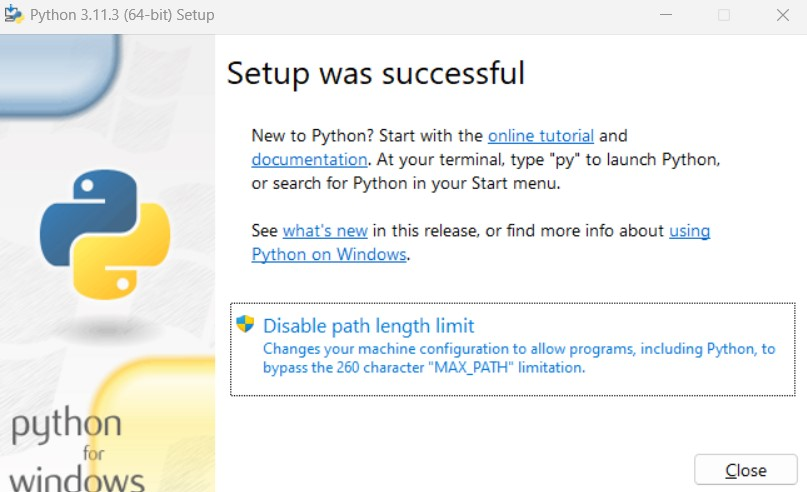
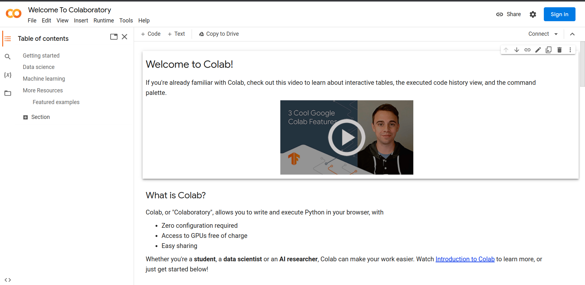
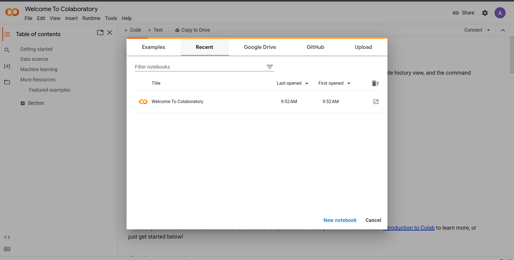

## Installation

1. Download and Install Python on Windows
    - Download Python Installer
        - Goto: https://www.python.org/downloads/
        - Download Stable `Python 3.x.x` installer appropriate to your system (64 bit or 32 bit).
            - Python 2 is a legacy version, it is not actively maintained by python itself
            - Organizations are shifting their codebase from python2 to python3
            - However, Learning python3, we will also know and able to learn python2 syntax.
    - **Installation on Windows**
        - Navigate to directory (Downloads) where the python installer is downloaded, `DOUBLE CLICK` to run python installer.
        - 
        - Select `Add python.exe to PATH` checkbox. This allows us to launch python from command line.
        - Options:
            - 1. If you to want install some advanced features, click `customize installation`.  
                - 
                - Check all of the checkbox available.
                    - `Documentation`: for python documentation.
                    - `pip`: python package manager, if you want to install custom package like Numpy, Pandas, etc
                    - `Python test suite`: for testing and learning
                    - `py launcer, for all users`: able to run python for users via command line.
                - In Advanced Options section:
                    - 
                    - check 2nd, 3rd, 4th checkbox.  
                - Click `Install`

            - 2. ELSE, Click `Install Now`
        - After installation completes, `Setup was successful` message displays.
            - 
        - **Verify Installation**
            - Goto start
            - Open Command Prompt
            - Type `python`
            - Desired Output:
                - 

2. Install Python on Linux Distribution
    - Linux Distribution already has python version installed.
    - Open your terminal, `Ctrl + Alt + T`
    - Update your local system's repository
        - `sudo apt update`
    - Download the latest version of Python3
        - `sudo apt install python3`
    - apt will find the packages, and install python in your system

3. Jupyter Lab Vs Jupyter Notebook
    - Jupyter Lab is advanced version of Jupyter Notebook. 
    - **Install Jupyter Lab**
        - pip install jupyter lab
        - jupyter lab
    - **Install Jupyter Notebook**
        - pip install notebook
        - jupyter notebooks

4. Download IDE (VSCode)
    - Vist https://code.visualstudio.com/download
    - Download and Install for your favourite Operating System
    - Run Vscode.

5. Google Colab
    - According to documentation, Colab or Colaboratory allows you to write and execute Python in your browser.
    - `features:`
        - Zero Configuration required
        - Access to GPUs free of charge
        - Easy sharing

    - `Steps:`
        1. Visit: https://colab.research.google.com/
        - 
        2. Sign in with your credentials
        - 
        3. After Sign in success, 
        - 

## References
- https://www.digitalocean.com/community/tutorials/install-python-windows-10
- https://www.makeuseof.com/install-python-ubuntu/
    